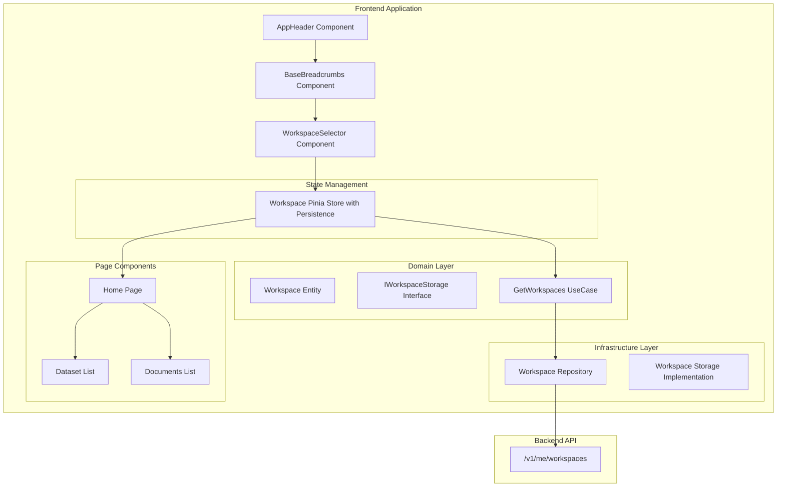
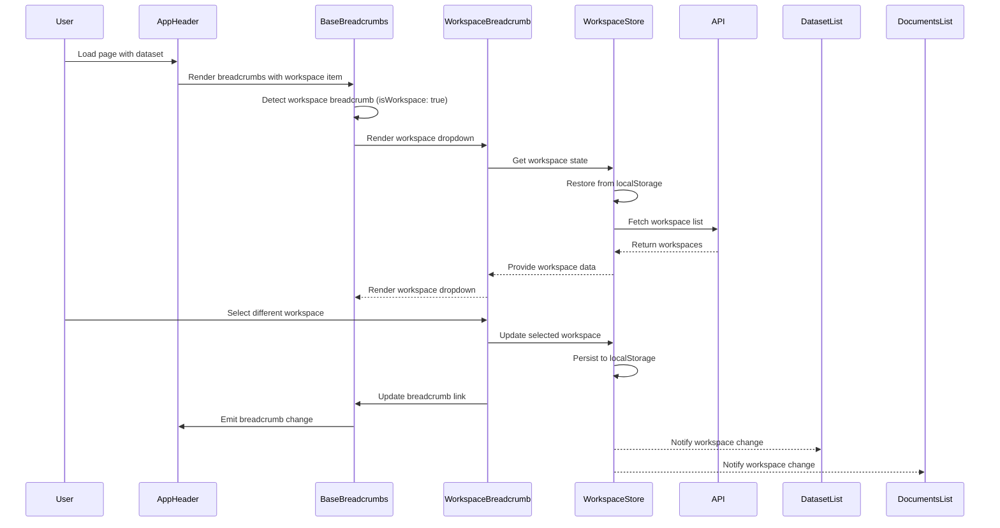

# Design Document

## Overview

The Global Workspace Selector feature implements a centralized workspace management system that moves workspace selection from local component filters to a persistent, header-based selector. The design leverages existing Pinia store patterns, local storage services, and component architecture to create a seamless workspace context that persists across all application pages.

The solution integrates workspace selection into the BaseBreadcrumbs component within the AppHeader, providing immediate access to workspace switching while maintaining consistency with existing UI patterns. The design emphasizes reusability of existing components and follows established architectural patterns for state management and persistence.

## Architecture

### High-Level Architecture



### Component Integration Flow



## Components and Interfaces

### Core Components

#### 1. Enhanced BaseBreadcrumbs Component

**Purpose**: Render workspace breadcrumb items as interactive dropdowns
**Location**: `components/base/base-breadcrumbs/BaseBreadcrumbs.vue`

**Key Features**:
- Detect workspace breadcrumb items and render them as dropdowns
- Maintain existing breadcrumb functionality for non-workspace items
- Dynamic link updates when workspace selection changes
- Integration with global workspace store

**Enhanced Breadcrumb Item Structure**:
```typescript
interface BreadcrumbItem {
  name: string
  link?: string | object
  action?: string
  isWorkspace?: boolean // New flag to identify workspace breadcrumbs
  workspaceId?: string // Current workspace ID for workspace breadcrumbs
}
```

**Workspace Breadcrumb Detection Logic**:
- When `isWorkspace: true` is set on a breadcrumb item, BaseBreadcrumbs renders WorkspaceBreadcrumbDropdown
- The dropdown shows the current workspace name and allows selection of other workspaces
- When a different workspace is selected, the breadcrumb link is dynamically updated
- The workspace change is persisted globally and affects all workspace-dependent components

**Home Page Breadcrumb Enhancement**:
- When no workspace is selected: `Home`
- When workspace is selected: `Home / [Workspace Dropdown]`
- The workspace breadcrumb allows switching between workspaces and updates dataset/document filtering
- URL updates to reflect selected workspace: `/?workspace=workspace-name`

**Example Home Page Breadcrumb Generation**:
```typescript
// In useHomeViewModel.ts
const breadcrumbs = computed(() => {
  const baseBreadcrumbs = [{ name: t('breadcrumbs.home'), action: 'clearFilters' }];

  if (selectedWorkspace.value) {
    baseBreadcrumbs.push({
      name: selectedWorkspace.value.name,
      link: { path: `/?workspace=${selectedWorkspace.value.name}` },
      isWorkspace: true,
      workspaceId: selectedWorkspace.value.id
    });
  }

  return baseBreadcrumbs;
});
```

**Props**:
```typescript
interface BaseBreadcrumbsProps {
  breadcrumbs: BreadcrumbItem[]
  copyButton?: boolean
}
```

#### 2. Workspace Breadcrumb Dropdown Component

**Purpose**: Render workspace selector as breadcrumb dropdown
**Location**: `components/base/base-breadcrumbs/WorkspaceBreadcrumbDropdown.vue`

**Key Features**:
- Reuse existing WorkspaceSelector logic in breadcrumb context
- Style as breadcrumb item with dropdown functionality
- Integration with global workspace store
- Dynamic link generation for workspace changes

#### 3. Dataset Breadcrumb Dropdown Component

**Purpose**: Render dataset selector as breadcrumb dropdown in annotation mode
**Location**: `components/base/base-breadcrumbs/DatasetBreadcrumbDropdown.vue`

**Key Features**:
- Similar to WorkspaceBreadcrumbDropdown but for dataset selection
- Filter datasets by selected workspace
- Update URL parameters when dataset changes
- Integration with existing dataset store
- Show current dataset name with dropdown to switch between datasets

**Dataset Breadcrumb Detection Logic**:
- When `isDataset: true` is set on a breadcrumb item, BaseBreadcrumbs renders DatasetBreadcrumbDropdown
- The dropdown shows the current dataset name and allows selection of other datasets in the same workspace
- When a different dataset is selected, navigate to the new dataset's annotation mode
- The dataset change updates the URL path: `/dataset/{new-dataset-id}/annotation-mode`

#### 4. Enhanced Breadcrumb Link Generation

**Purpose**: Update breadcrumb links when workspace changes
**Location**: Various view models (useDatasetViewModel.ts, etc.)

**Key Features**:
- Detect workspace parameters in breadcrumb links
- Regenerate links when workspace selection changes
- Maintain existing breadcrumb structure and navigation

### State Management Layer

#### 1. Workspace Storage Interface

**Purpose**: Define contract for workspace state management
**Location**: `v1/domain/services/IWorkspaceStorage.ts`

```typescript
export interface IWorkspaceStorage {
  saveWorkspaces(workspaces: Workspace[]): void
  saveSelectedWorkspace(workspace: Workspace | null): void
}
```

#### 2. Workspace Storage Implementation

**Purpose**: Pinia store implementation for workspace state with integrated persistence
**Location**: `v1/infrastructure/storage/WorkspaceStorage.ts`

**Key Features**:
- Workspace list management
- Selected workspace persistence via localStorage
- Reactive state updates
- Integrated persistence following existing DatasetsStorage pattern

```typescript
class Workspaces {
  constructor(
    public readonly workspaces: Workspace[] = [],
    public readonly selectedWorkspace: Workspace | null = null
  ) {}
}

export const useWorkspaces = () => {
  const workspaceStore = useStoreForWorkspaces();

  const saveWorkspaces = (workspaces: Workspace[]) => {
    workspaceStore.save(new Workspaces(workspaces, workspaceStore.get().selectedWorkspace));
  };

  const saveSelectedWorkspace = (workspace: Workspace | null) => {
    workspaceStore.save(new Workspaces(workspaceStore.get().workspaces, workspace));
  };

  return { ...workspaceStore, saveWorkspaces, saveSelectedWorkspace };
};
```

### Domain Layer

#### 1. Enhanced Workspace Entity

**Purpose**: Extend existing Workspace entity if needed
**Location**: `v1/domain/entities/workspace/Workspace.ts`

**Current Structure**:
```typescript
export class Workspace {
  constructor(
    public readonly id: string,
    public readonly name: string
  ) {}
}
```

#### 2. Get Workspaces Use Case

**Purpose**: Orchestrate workspace fetching and state management
**Location**: `v1/domain/usecases/get-workspaces-use-case.ts`

**Key Features**:
- Fetch workspaces from repository
- Update workspace store
- Handle error scenarios
- Restore selected workspace from persistence

## Data Models

### Workspace State Model

```typescript
interface Workspaces {
  workspaces: Workspace[]
  selectedWorkspace: Workspace | null
  isLoading: boolean
  error: string | null
}
```

### Dataset Breadcrumb Model

```typescript
interface DatasetBreadcrumbItem extends BreadcrumbItem {
  isDataset?: boolean
  datasetId?: string
  workspaceId?: string
}
```

## Error Handling

### Error Scenarios and Responses

1. **Workspace API Failure**
   - Display error message in workspace selector
   - Provide retry mechanism
   - Fall back to cached workspace data if available

2. **Invalid Persisted Workspace**
   - Automatically select first available workspace
   - Clear invalid workspace from local storage
   - Log warning for debugging

3. **Local Storage Unavailable**
   - Continue with session-only workspace selection
   - Display warning about lack of persistence
   - Gracefully degrade functionality

4. **Workspace Access Revoked**
   - Remove workspace from available list
   - Auto-select alternative workspace
   - Notify user of access change

### Error Recovery Strategies

```typescript
interface ErrorRecoveryStrategy {
  retryAttempts: number
  fallbackWorkspace: Workspace | null
  userNotification: boolean
  logLevel: 'info' | 'warn' | 'error'
}
```

## Testing Strategy

### Unit Testing

1. **Workspace Storage Tests**
   - Test Pinia store state management
   - Verify local storage integration
   - Test reactive updates

2. **Component Integration Tests**
   - Test BaseBreadcrumbs with workspace selector
   - Verify workspace selection events
   - Test responsive layout behavior

3. **Use Case Tests**
   - Test workspace fetching logic
   - Verify error handling scenarios
   - Test persistence restoration

### Integration Testing

1. **End-to-End Workspace Flow**
   - Test complete workspace selection workflow
   - Verify persistence across page navigation
   - Test workspace filtering in dataset/document lists

2. **Error Scenario Testing**
   - Test API failure handling
   - Verify graceful degradation
   - Test recovery mechanisms

### Component Testing

1. **WorkspaceSelector Component**
   - Test dropdown functionality
   - Verify search filtering
   - Test selection events

2. **BaseBreadcrumbs Enhancement**
   - Test workspace selector integration
   - Verify existing breadcrumb functionality
   - Test responsive behavior

## Implementation Phases

### Phase 1: Core Infrastructure
- Create workspace storage interface and implementation
- Implement workspace persistence service
- Create enhanced get workspaces use case

### Phase 2: Component Integration
- Enhance BaseBreadcrumbs component
- Integrate WorkspaceSelector into header
- Update AppHeader component

### Phase 3: State Management
- Implement global workspace store
- Add reactive workspace filtering
- Update existing components to use global state

### Phase 4: Testing and Polish
- Implement comprehensive test suite
- Add error handling and recovery
- Performance optimization and accessibility

## Performance Considerations

### Optimization Strategies

1. **Lazy Loading**
   - Load workspace data only when needed
   - Cache workspace list with appropriate TTL

2. **Reactive Updates**
   - Use computed properties for filtered data
   - Minimize unnecessary re-renders

3. **Local Storage Efficiency**
   - Store only essential workspace data
   - Implement storage cleanup for old preferences

4. **API Optimization**
   - Leverage existing caching mechanisms
   - Batch workspace-related API calls

### Memory Management

- Proper cleanup of event listeners
- Efficient Pinia store state management
- Avoid memory leaks in component lifecycle