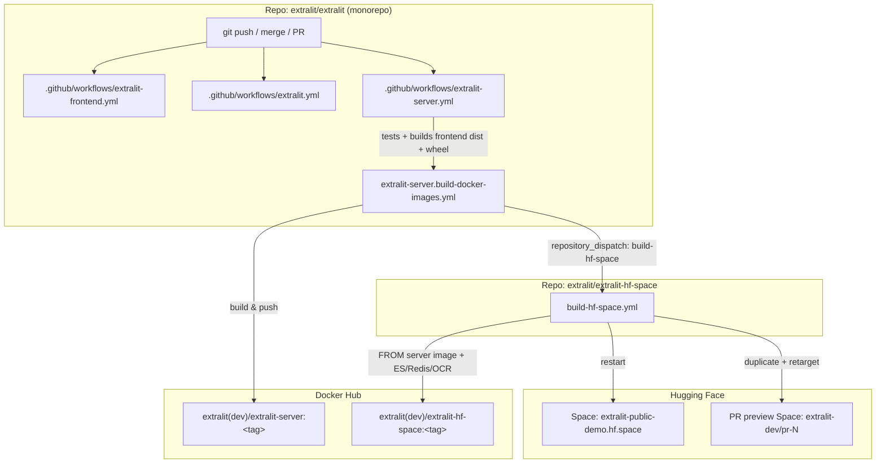

# Deployment & CI/CD Architecture

How a code change in any monorepo module flows through GitHub Actions to the
public demo at **<https://extralit-public-demo.hf.space>**.

This document traces the end-to-end pipeline that turns a commit into a running
Hugging Face Space. The terminal step is
[`extralit-hf-space/.github/workflows/build-hf-space.yml`](../../extralit-hf-space/.github/workflows/build-hf-space.yml),
which lives in the **separate** `extralit/extralit-hf-space` repository (vendored
here as a git submodule).

---

## 1. The big picture

The pipeline spans **two repositories** and is glued together by a GitHub
`repository_dispatch` event:



**Key insight:** the HF Space image is built **`FROM` the `extralit-server`
image**. The server image, in turn, bundles the **compiled frontend** at build
time. So the Space is rebuilt and redeployed by the **`extralit-server`
workflow** — not by the frontend or SDK workflows directly. See
[§5 Gotchas](#5-gotchas--operational-notes).

---

## 2. Module → workflow routing

Each module has its own workflow, gated by `paths:` filters so unrelated changes
don't trigger unrelated builds.

| Module (dir)        | Workflow                          | Triggers on path                              | Produces                                            | Reaches the demo? |
| ------------------- | --------------------------------- | --------------------------------------------- | --------------------------------------------------- | ----------------- |
| `extralit-server/`  | `extralit-server.yml`             | `extralit-server/**`                          | `extralit-server` Docker image + PyPI wheel         | **Yes** (drives it) |
| `extralit-frontend/`| `extralit-frontend.yml`           | `extralit-frontend/**`                        | Frontend `dist/` artifact (tests/lint only)         | Indirect¹         |
| `extralit/` (SDK)   | `extralit.yml`                    | `extralit/**` (excl. `docs/`, `mkdocs.yml`)   | `extralit` PyPI wheel                               | No²               |
| `extralit-hf-space/`| `build-hf-space.yml` *(other repo)* | repository_dispatch / manual                | `extralit-hf-space` Docker image + Space restart    | **Yes** (terminal) |

¹ The frontend's own workflow only tests and uploads a `dist` artifact. The
frontend that actually ships is **recompiled from source inside the server
workflow** (see §3). A frontend-only change does not redeploy the Space on its
own — it needs the server workflow to run.

² The SDK is published to PyPI and is *consumed by* the demo's CI for
integration tests (it spins up `extralitdev/extralit-hf-space:latest` as a
service container), but SDK changes never rebuild the Space image.

---

## 3. Stage A — `extralit-server.yml` (in the monorepo)

File: [`.github/workflows/extralit-server.yml`](../../.github/workflows/extralit-server.yml)

Triggered by push to `main`/`develop`/`releases/**`, by non-fork PRs, or
manually (`workflow_dispatch`).

### Job `build`
1. Spins up service containers (Elasticsearch, Postgres, Redis, MinIO) and runs
   `pytest tests/unit` with coverage → Codecov.
2. **Compiles the frontend from source** (`npm install && npm run build` in
   `extralit-frontend/`) using `BASE_URL=@@baseUrl@@` (a placeholder rewritten at
   runtime to support a parameterizable root path).
3. Copies `extralit-frontend/dist` into `src/extralit_server/static`, then
   `uv build` → uploads the `extralit-server` wheel artifact.

### Job `build_docker_images` → `extralit-server.build-docker-images.yml`
File: [`.github/workflows/extralit-server.build-docker-images.yml`](../../.github/workflows/extralit-server.build-docker-images.yml)

Runs only on `main` / `develop` / `releases/**` / `workflow_dispatch` / non-fork
non-draft PRs.

| Input                  | `is_release` (main / dispatch) | dev (develop / PR)              |
| ---------------------- | ------------------------------ | ------------------------------- |
| Docker org             | `extralit/extralit-server`     | `extralitdev/extralit-server`   |
| Platforms              | `linux/amd64,linux/arm64`      | `linux/amd64`                   |
| Image tag              | `v<package_version>`           | branch name (cleaned) or `pr-N` |
| Publish `:latest`      | only on `main`                 | always (dev `:latest`)          |

The tag is derived by the
[`docker-image-tag-from-ref`](../../.github/actions/docker-image-tag-from-ref)
composite action: tags → `<tag>`, PRs → `pr-<number>`, branches →
`<branch>` with non-alphanumerics replaced by `-`.

After building & pushing the server image, the final step fires the
cross-repo trigger:

```yaml
- name: Trigger HF-Space build
  uses: peter-evans/repository-dispatch@v3
  with:
    token: ${{ secrets.GH_ACTIONS_REPOSITORY_DISPATCH }}
    repository: extralit/extralit-hf-space
    event-type: build-hf-space
    client-payload: '{"tag":"${{ env.IMAGE_TAG }}","is_release":${{ inputs.is_release }},"branch":"${{ github.ref_name }}"}'
```

This hands off control — with `tag`, `is_release`, and `branch` — to the HF Space
repo.

> The `publish_release` job additionally publishes the `extralit-server` wheel to
> (Test)PyPI on `main`/dispatch. Not part of the Space deploy.

---

## 4. Stage B — `build-hf-space.yml` (in `extralit/extralit-hf-space`)

File: [`extralit-hf-space/.github/workflows/build-hf-space.yml`](../../extralit-hf-space/.github/workflows/build-hf-space.yml)

Entry points:
- **`repository_dispatch` / `build-hf-space`** — the automated path from Stage A.
- **`workflow_dispatch`** — manual rebuild of the current ref (`develop` env, tag
  `latest`, amd64 only).

### Job `resolve-env`
Pure-bash step that maps the dispatch payload to build parameters:

| Source branch / event                | `env_name` | `image_tag`        | `tag_latest` | `platforms`                 | `pr_space_slug` |
| ------------------------------------- | ---------- | ------------------ | ------------ | --------------------------- | --------------- |
| `is_release=true` → `main`            | `main`     | payload `tag` (`v…`) | `true`     | `amd64,arm64`               | — (empty)       |
| `branch=develop`                      | `develop`  | payload `tag`      | `true`       | `amd64`                     | — (empty)       |
| any other branch (PR)                 | `develop`  | payload `tag`      | `false`      | `amd64`                     | `pr-N` / slug   |
| `workflow_dispatch`                   | per ref    | `latest`           | `false`/`true`| `amd64`                     | per ref         |

`env_name` selects the GitHub **Environment** (`main` vs `develop`), which is how
per-environment secrets/vars are scoped: `DOCKER_REPO`, `EXTRALIT_SERVER_IMAGE`,
`HF_SPACE_ID`, `HF_TOKEN`, `DOCKER_USERNAME`/`DOCKER_PASSWORD`.

### Job `build`
Builds the self-contained Space image **on top of the server image**:

```yaml
build-args: |
  EXTRALIT_SERVER_IMAGE=${{ vars.EXTRALIT_SERVER_IMAGE }}
  EXTRALIT_VERSION=${{ needs.resolve-env.outputs.image_tag }}
```

The [`Dockerfile`](../../extralit-hf-space/Dockerfile) does
`FROM ${EXTRALIT_SERVER_IMAGE}:${EXTRALIT_VERSION}` and layers on **Elasticsearch
8.17**, **Redis**, the **OCR/PDF-extraction** package, and a Procfile-based
multi-process runtime (elastic + redis + RQ workers + FastAPI). Pushed to
`extralit/extralit-hf-space` (main) or `extralitdev/extralit-hf-space` (dev),
tagging `:latest` when `tag_latest=true`.

### Job `deploy-space` — *non-PR builds only* (`pr_space_slug == ''`)
Restarts the live Space so it pulls the freshly pushed image:

```bash
curl -X POST "https://huggingface.co/api/spaces/${HF_SPACE_ID}/restart" \
     -H "Authorization: Bearer $HF_TOKEN"
```

`HF_SPACE_ID` is the environment-scoped Space (see §5): the **`main`**
environment points at `extralit/public-demo` — the live public demo served at
**<https://extralit-public-demo.hf.space>** — while the **`develop`**
environment points at `extralit-dev/develop`
(`extralit-dev-develop.hf.space`).

### Job `deploy-pr-space` — *PR builds only* (`pr_space_slug != ''`)
Creates an ephemeral preview Space per PR:
1. `duplicate_space("extralit-dev/develop" → "extralit-dev/pr-N")` (cpu-basic) on
   first run, writing a README that enables `app_port: 6900` + HF OAuth.
2. Uploads a one-line `Dockerfile` (`FROM extralitdev/extralit-hf-space:pr-N`) so
   the preview Space tracks the PR's image.

---

## 5. Environment & secret reference

Resolved live from GitHub on 2026-06-10 via `gh api`. The `build-hf-space.yml`
jobs run with `environment: ${{ resolve-env.outputs.env_name }}`, so `vars.*` and
`secrets.*` resolve **per environment**.

### `extralit/extralit-hf-space` — Environment **variables** (`vars.*`)

| Variable               | `main` environment            | `develop` environment           |
| ---------------------- | ----------------------------- | ------------------------------- |
| `DOCKER_REPO`          | `extralit/extralit-hf-space`  | `extralitdev/extralit-hf-space` |
| `EXTRALIT_SERVER_IMAGE`| `extralit/extralit-server`    | `extralitdev/extralit-server`   |
| `HF_SPACE_ID`          | `extralit/public-demo`        | `extralit-dev/develop`          |

> The `HF_SPACE_ID` values map to Space URLs `<owner>-<name>.hf.space`:
> `extralit/public-demo` → **extralit-public-demo.hf.space** (the public demo,
> deployed from `main`); `extralit-dev/develop` → extralit-dev-develop.hf.space.
> There are **no** repo-level variables in this repo.

### `extralit/extralit-hf-space` — **Secrets** (names only)

| Secret            | Repo-level | `main` env | `develop` env |
| ----------------- | :--------: | :--------: | :-----------: |
| `HF_TOKEN`        | ✅ (default) | ✅ (override) | ✅ (override) |
| `DOCKER_USERNAME` |     —      |     ✅      |      ✅       |
| `DOCKER_PASSWORD` |     —      |     ✅      |      ✅       |

### `extralit/extralit` (monorepo)

- **Repo variables:** none.
- **Repo secrets:** `ANTHROPIC_API_KEY`, `GH_ACCESS_TOKEN`.
- **Environments:** `HuggingFace` (no vars/secrets of its own), `copilot`,
  `github-pages`.
- The server/SDK workflows reference secrets like `AR_DOCKER_USERNAME(_DEV)`,
  `AR_DOCKER_PASSWORD(_DEV)`, `GH_ACTIONS_REPOSITORY_DISPATCH`, `CODECOV_TOKEN`,
  `AR_PYPI_API_TOKEN`, and `HF_TOKEN_EXTRALIT_INTERNAL_TESTING`. These are **not**
  defined at the repo or `HuggingFace`-environment level — they are inherited
  from **organization-level** secrets via `secrets: inherit` (reading them
  requires the `admin:org` scope).

### Workflow-internal GHA env vars (computed at run time)

Beyond the stored `vars.*`/`secrets.*` above, the deploy is driven by env vars
**computed inside the run** from the branch/event. These are what you read in
the Actions logs when debugging a deploy.

**Stage A — `extralit-server.build-docker-images.yml`** (`env:` set per
`is_release`):

| Env var                  | Release (`main` / dispatch)      | Dev (`develop` / PR)              |
| ------------------------ | -------------------------------- | --------------------------------- |
| `IS_RELEASE`             | `true`                           | `false`                           |
| `PLATFORMS`              | `linux/amd64,linux/arm64`        | `linux/amd64`                     |
| `IMAGE_TAG`              | `v<package_version>`             | branch (cleaned) or `pr-N`        |
| `SERVER_DOCKER_IMAGE`    | `extralit/extralit-server`       | `extralitdev/extralit-server`     |
| `HF_SPACES_DOCKER_IMAGE` | `extralit/extralit-hf-space`     | `extralitdev/extralit-hf-space`   |
| `PUBLISH_LATEST`         | `inputs.publish_latest` (main)   | `true`                            |
| `DOCKER_USERNAME/PASSWORD`| `AR_DOCKER_*` secrets            | `AR_DOCKER_*_DEV` secrets         |

The cross-repo `client-payload` carries the handoff state:
`tag` = `IMAGE_TAG`, `is_release` = `inputs.is_release`, `branch` =
`github.ref_name`.

**Stage B — `build-hf-space.yml`**:

| Env var / output            | Source                                    | Role in deploy                                  |
| --------------------------- | ----------------------------------------- | ----------------------------------------------- |
| `EVENT_NAME`                | `github.event_name`                       | `repository_dispatch` vs `workflow_dispatch`    |
| `PAYLOAD_TAG`               | `client_payload.tag`                      | → `image_tag`                                    |
| `PAYLOAD_BRANCH`            | `client_payload.branch`                   | branch routing                                   |
| `PAYLOAD_IS_RELEASE`        | `client_payload.is_release`               | selects `main` env / multi-arch                  |
| `env_name` *(output)*       | resolved from branch/payload              | `environment:` → which `vars.*`/`secrets.*` load |
| `image_tag` *(output)*      | payload tag, or `latest` (manual)         | Docker tag built & deployed                      |
| `tag_latest` *(output)*     | `true` on main/develop                    | also tag/push `:latest`                          |
| `platforms` *(output)*      | `amd64` (dev) / `amd64,arm64` (release)   | buildx target platforms                          |
| `pr_space_slug` *(output)*  | `pr-N` / slug for non-main/develop        | empty → restart live Space; set → PR preview     |
| `DOCKER_TAGS`               | `${DOCKER_REPO}:${IMAGE_TAG}[,:latest]`   | tags pushed by build job                          |
| `EXTRALIT_SERVER_IMAGE` *(build-arg)* | `vars.EXTRALIT_SERVER_IMAGE`    | base image the Space is built `FROM`             |
| `EXTRALIT_VERSION` *(build-arg)*      | `image_tag`                     | base image tag (→ Dockerfile `ARG`)              |
| `SOURCE_SPACE`              | `extralit-dev/develop` (hardcoded)        | template duplicated for PR preview Spaces        |
| `DOCKER_REPO` (pr job)      | `extralitdev/extralit-hf-space` (hardcoded)| image PR preview Space points at                |

> The `extralit-hf-space` [`Dockerfile`](../../extralit-hf-space/Dockerfile)
> consumes the two build-args as `ARG EXTRALIT_SERVER_IMAGE` and
> `ARG EXTRALIT_VERSION`, resolving `FROM ${EXTRALIT_SERVER_IMAGE}:${EXTRALIT_VERSION}`.

---

## 6. Gotchas & operational notes

- **Frontend changes don't auto-deploy the demo.** A commit touching only
  `extralit-frontend/**` runs `extralit-frontend.yml` (tests + artifact) but does
  **not** trigger `extralit-server.yml`, whose path filter is
  `extralit-server/**`. The shipped frontend is rebuilt from source *inside* the
  server workflow. To roll a frontend-only change to the demo, also touch the
  server (or run `extralit-server.yml` via `workflow_dispatch`).
- **Two Docker orgs.** `extralit/*` = release (from `main`), `extralitdev/*` =
  dev (from `develop`/PRs). The demo's `EXTRALIT_SERVER_IMAGE` env var picks
  which base it builds on.
- **Cross-repo token.** The handoff depends on
  `secrets.GH_ACTIONS_REPOSITORY_DISPATCH` (a PAT with dispatch rights on
  `extralit/extralit-hf-space`). If the Space stops updating after server merges,
  check this token first.
- **Multi-arch only on release.** Dev/develop builds are `linux/amd64` only;
  `arm64` is added only for `is_release` (main) builds.
- **Manual recovery.** You can rebuild/redeploy the Space directly from the
  `extralit-hf-space` repo via **Actions → Build & Deploy HF Space → Run
  workflow** (`workflow_dispatch`), bypassing the monorepo entirely.

---

## 7. End-to-end summary

### Release → public demo (`main`)

1. PR merged to `main` touching `extralit-server/**`.
2. `extralit-server.yml` → tests, builds frontend `dist`, bundles it, builds wheel.
3. `build_docker_images` (`is_release=true`) → pushes
   `extralit/extralit-server:v<version>` (+`:latest`), multi-arch amd64+arm64.
4. `repository_dispatch(build-hf-space, {tag: v<version>, is_release: true})` → fires.
5. `build-hf-space.yml` → `resolve-env` (env=`main`) → builds
   `extralit/extralit-hf-space:v<version>` `FROM` the server image.
6. `deploy-space` → `POST /spaces/extralit/public-demo/restart`.
7. Public demo live at **<https://extralit-public-demo.hf.space>**.

### Staging (`develop`)

Same flow, env=`develop`: `extralitdev/*` images tagged `develop` (+`:latest`,
amd64-only), restarting `extralit-dev/develop` → extralit-dev-develop.hf.space.
