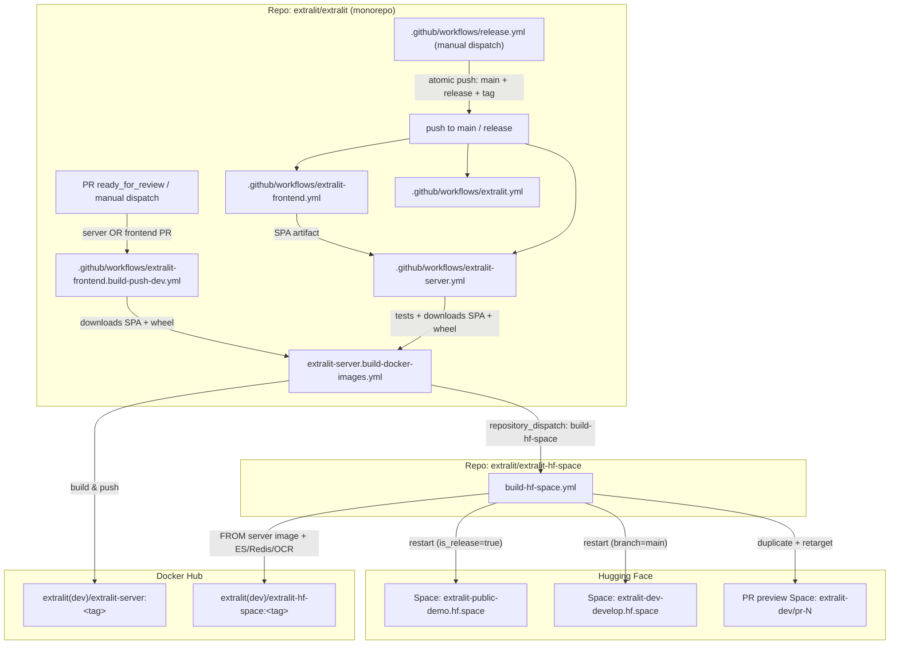

# Deployment & CI/CD Architecture

How a code change in any monorepo module flows through GitHub Actions to the
public demo at **<https://extralit-public-demo.hf.space>**.

This document traces the end-to-end pipeline that turns a commit into a running
Hugging Face Space. The terminal step is
[`extralit-hf-space/.github/workflows/build-hf-space.yml`](../../extralit-hf-space/.github/workflows/build-hf-space.yml),
which lives in the **separate** `extralit/extralit-hf-space` repository (vendored
here as a git submodule).

---

## 0. Branching model

Extralit is **trunk-based**. There is no `develop` branch and no `releases/**`
branches.

| Ref | Role | Images | Deploys to |
| --- | --- | --- | --- |
| `main` | trunk, default branch; every merged PR | `extralitdev/*:main` + `:latest`, amd64 | `extralit-dev/develop` |
| `release` | long-lived production pointer | `extralit/*:vX.Y.Z` + `:latest`, amd64+arm64 | `extralit/public-demo` |
| `vX.Y.Z` tag | the release itself | — | PyPI, versioned docs, GitHub Release |
| PR (`N/merge`) | preview | `extralitdev/*:pr-N`, amd64 | ephemeral `extralit-dev/pr-N` |

`release` is always a tagged point on `main`'s history: the release workflow
pushes one version-stamp commit to `main`, `release`, and the tag **atomically**,
so all three land at the same SHA. Nothing else ever writes to `release`, and
production only moves when [`release.yml`](../../.github/workflows/release.yml)
is deliberately dispatched. See
[`extralit/docs/community/release_guide.md`](../../extralit/docs/community/release_guide.md).

**`is_release` is the only production signal.** Branch names are not load-bearing
in the deploy path — the HF Space repo routes on the dispatch payload's
`is_release` flag, so a payload without it can never reach production whatever
branch it names.

---

## 1. The big picture

The pipeline spans **two repositories** and is glued together by a GitHub
`repository_dispatch` event:



**Key insight:** the HF Space image is built **`FROM` the `extralit-server`
image**, and the server image bundles a **prebuilt frontend SPA** as its fallback
UI. So the demo is rebuilt by whichever workflow rebuilds that server image: the
**`extralit-server`** workflow drives `main` and `release`, and
**`extralit-frontend.build-push-dev.yml`** drives per-PR ephemeral Spaces (it
rebuilds the same server image — SPA baked in — so frontend-only PRs get a
preview too). Both hand off to the same `build-docker-images.yml` +
`repository_dispatch`. See [§6 Gotchas](#6-gotchas--operational-notes).

---

## 2. Module → workflow routing

Each module has its own workflow, gated by `paths:` filters so unrelated changes
don't trigger unrelated builds. All three run on **push to `main`/`release`** and
on **`pull_request`**.

| Module (dir)        | Workflow                          | Triggers on path                              | Produces                                            | Reaches the demo? |
| ------------------- | --------------------------------- | --------------------------------------------- | --------------------------------------------------- | ----------------- |
| `extralit-server/`  | `extralit-server.yml`             | `extralit-server/**` (push/PR)                | `extralit-server` Docker image + PyPI wheel         | **Yes** (`main` → dev Space; `release` → public demo) |
| `extralit-frontend/`| `extralit-frontend.yml`           | `extralit-frontend/**`                        | Prerendered SPA artifact (plus tests/lint)          | Indirect¹         |
| *(server **or** frontend PR)* | `extralit-frontend.build-push-dev.yml` | PR `ready_for_review` on `extralit-server/**` **or** `extralit-frontend/**`; or manual `pr_number` | `extralitdev/extralit-server:pr-N` image → ephemeral Space | **Yes** (`extralit-dev/pr-N`) |
| `extralit/` (SDK)   | `extralit.yml`                    | `extralit/**` (excl. `docs/`, `mkdocs.yml`)   | `extralit` PyPI wheel                               | No²               |
| `extralit/docs/`    | `extralit.docs.yml`               | `extralit/docs/**`, `mkdocs.yml`              | Versioned docs via `mike` → `gh-pages`              | No                |
| *(whole repo)*      | `release.yml`                     | manual dispatch only                          | version stamp on `main` + `release` + `vX.Y.Z` tag  | **Yes** (indirectly) |
| `extralit-hf-space/`| `build-hf-space.yml` *(other repo)* | repository_dispatch / manual                | `extralit-hf-space` Docker image + Space restart/deploy | **Yes** (terminal) |

¹ The frontend's own workflow tests, lints, and uploads a prerendered SPA
artifact; the **live** UI is deployed separately by Vercel's native Git
integration (configured in `extralit-frontend/vercel.ts`, not by any workflow).
The SPA the *server* ships is downloaded from this workflow's artifact (see §3).
A frontend-only change does not redeploy the public demo on its own — that needs
a release — but a frontend-only **PR** *does* get an ephemeral preview (see §3a).

² The SDK is published to PyPI and is *consumed by* the demo's CI for
integration tests (it spins up `extralitdev/extralit-hf-space:latest` as a
service container), but SDK changes never rebuild the Space image.

---

## 3. Stage A — `extralit-server.yml` (in the monorepo)

File: [`.github/workflows/extralit-server.yml`](../../.github/workflows/extralit-server.yml)

Triggered by push to `main`/`release`, by pull requests, or manually
(`workflow_dispatch`).

### Job `build`
1. Spins up service containers (Elasticsearch, Postgres, Redis, MinIO) and runs
   `pytest tests/unit` with coverage → Codecov.
2. **Downloads the prebuilt frontend SPA** via the
   [`download-frontend-artifact`](../../.github/actions/download-frontend-artifact)
   composite action, which fetches the latest successful `extralit-frontend.yml`
   artifact for `main` — **always `main`**, release builds included, because the
   action needs a *previously successful* run on the branch it names and `release`
   only ever carries a commit that already landed on `main`. The server does
   **not** run `npm`.
3. Copies `extralit-frontend/.output/public` into `src/extralit_server/static`,
   asserts `index.html` exists, then `uv build` → uploads the `extralit-server`
   wheel artifact.

> **Why prebuilt, and why `BASE_URL=/`.** Since the Nuxt 4 migration the SPA is
> prerendered by `nuxi generate` at `BASE_URL=/` and shipped as static files; the
> old Nuxt 2 `@@baseUrl@@` placeholder breaks Nuxt 4's prerender crawler.
> Parameterizable sub-path hosting is a separate follow-up. The SPA is otherwise
> env-agnostic (it calls a relative `/api`), so one artifact works wherever the
> server is deployed.

### Job `build_docker_images` → `extralit-server.build-docker-images.yml`
File: [`.github/workflows/extralit-server.build-docker-images.yml`](../../.github/workflows/extralit-server.build-docker-images.yml)

Runs on branch pushes (`main` / `release`) and `workflow_dispatch` only —
`github.ref_type == 'branch' && github.event_name != 'pull_request'`. **PRs run
tests and nothing else here;** their preview images come from
`extralit-frontend.build-push-dev.yml` (§3a), which is the only caller that
passes `pr_number`. Tag pushes are excluded too: the image was already built from
the `release` push at the same SHA, and a tag-triggered build would dispatch
`branch=vX.Y.Z`, which `resolve-env` would turn into a junk preview Space.

| Input                  | `is_release` (`release` branch) | dev (`main` / PR)               |
| ---------------------- | ------------------------------- | ------------------------------- |
| Docker org             | `extralit/extralit-server`      | `extralitdev/extralit-server`   |
| Platforms              | `linux/amd64,linux/arm64`       | `linux/amd64`                   |
| Image tag              | `v<package_version>`            | branch name (cleaned) or `pr-N` |
| Publish `:latest`      | only on `release`               | dev `:latest`, except PR previews (`pr_number` set) |

The version comes from
[`scripts/bump_version.py check`](../../scripts/bump_version.py), the single
owner of the three files that carry it. The dev tag is derived by the
[`docker-image-tag-from-ref`](../../.github/actions/docker-image-tag-from-ref)
composite action: tags → `<tag>`, PRs → `pr-<number>`, branches → `<branch>` with
non-alphanumerics replaced by `-`.

After building & pushing the server image, the final step fires the
cross-repo trigger:

```yaml
- name: Trigger HF-Space build
  uses: peter-evans/repository-dispatch@v3
  with:
    token: ${{ secrets.GH_ACTIONS_REPOSITORY_DISPATCH }}
    repository: extralit/extralit-hf-space
    event-type: build-hf-space
    client-payload: '{"tag":"${{ env.IMAGE_TAG }}","is_release":${{ inputs.is_release }},"branch":"${{ env.DISPATCH_BRANCH }}"}'
```

This hands off control — with `tag`, `is_release`, and `branch` — to the HF Space
repo. `DISPATCH_BRANCH` is `github.ref_name` normally, or `<n>/merge` when the
reusable build is called with the optional `pr_number` input (manual PR preview),
so `resolve-env` routes to `pr_space_slug=pr-N`.

> The `publish_release` job publishes the `extralit-server` wheel to (Test)PyPI,
> and fires **only on a `vX.Y.Z` tag push** — not on branch pushes. Under
> trunk-based development a branch-gated publish would try to release on every
> merge to `main`. Not part of the Space deploy.

---

## 3a. PR preview — `extralit-frontend.build-push-dev.yml` (in the monorepo)

File: [`.github/workflows/extralit-frontend.build-push-dev.yml`](../../.github/workflows/extralit-frontend.build-push-dev.yml)
(its `name:` is **"Deploy PR preview HF Space"**)

A single-purpose workflow that gives any server- **or** frontend-touching PR an
ephemeral Space, deliberately decoupled from `extralit-server.yml` so it does
**not** run on every push:

- **Auto:** `pull_request: types: [ready_for_review]` on `extralit-server/**` or
  `extralit-frontend/**`. Marking a PR ready (not each subsequent push) builds the
  preview; refresh later via the manual path. (`ready_for_review` only fires on a
  draft→ready transition — a PR opened directly as non-draft won't auto-trigger;
  re-mark it ready or use the manual path.)
- **Manual:** `workflow_dispatch` with a `pr_number` input — (re)deploy a chosen PR
  on demand, resolving `refs/pull/<n>/merge` so the run is self-contained.

Its `build` job downloads the prebuilt SPA and builds the wheel (no pytest), then
calls the same [`build-docker-images.yml`](../../.github/workflows/extralit-server.build-docker-images.yml)
with `is_release: false` and `pr_number`. Result: `extralitdev/extralit-server:pr-N`
is pushed and the dispatch (`branch=<n>/merge`) drives the HF Space repo's
`deploy-pr-space` job → **`extralit-dev/pr-N`** (`extralit-dev-pr-N.hf.space`).
`main`/`release` deploys are untouched and still flow through §3.

A third job, `point-preview-at-pr-space`, best-effort points the PR's **Vercel**
preview at that PR's own Space by setting a branch-scoped `API_BASE_URL` preview
env var and redeploying. It never blocks the pipeline.

---

## 4. Stage B — `build-hf-space.yml` (in `extralit/extralit-hf-space`)

File: [`extralit-hf-space/.github/workflows/build-hf-space.yml`](../../extralit-hf-space/.github/workflows/build-hf-space.yml)

Entry points:
- **`repository_dispatch` / `build-hf-space`** — the automated path from Stage A.
- **`workflow_dispatch`** — manual rebuild of the current ref. Carries no
  payload, so it always resolves to `staging`; a manual run **cannot** reach
  production.

### Job `resolve-env`
Pure-bash step that maps the dispatch payload to build parameters. It branches on
`is_release` **first**; branch names only distinguish trunk from preview:

| Payload                               | `env_name`   | `image_tag`          | `tag_latest` | `platforms`   | `pr_space_slug` |
| ------------------------------------- | ------------ | -------------------- | ------------ | ------------- | --------------- |
| `is_release=true`                     | `production` | payload `tag` (`v…`) | `true`       | `amd64,arm64` | — (empty)       |
| `branch=main` (or `develop`†)         | `staging`    | payload `tag`        | `true`       | `amd64`       | — (empty)       |
| any other branch (PR merge ref)       | `staging`    | payload `tag`        | `false`      | `amd64`       | `pr-N` / slug   |
| `workflow_dispatch`                   | `staging`    | `latest`             | per ref      | `amd64`       | per ref         |

† `develop` is a **migration alias** kept so dispatches still in flight from the
pre-trunk monorepo land on staging instead of spinning up a stray preview Space.
Remove it once the trunk flip has been verified.

`env_name` selects the GitHub **Environment** (`production` vs `staging`), which
is how per-environment secrets/vars are scoped: `DOCKER_REPO`,
`EXTRALIT_SERVER_IMAGE`, `HF_SPACE_ID`, `HF_TOKEN`,
`DOCKER_USERNAME`/`DOCKER_PASSWORD`.

### Job `build`
Builds the self-contained Space image **on top of the server image**:

```yaml
build-args: |
  EXTRALIT_SERVER_IMAGE=${{ vars.EXTRALIT_SERVER_IMAGE }}
  EXTRALIT_VERSION=${{ needs.resolve-env.outputs.image_tag }}
```

The [`Dockerfile`](../../extralit-hf-space/Dockerfile) does
`FROM ${EXTRALIT_SERVER_IMAGE}:${EXTRALIT_VERSION}` and layers on **Elasticsearch
8.17**, **Redis**, the **OCR/PDF-extraction** package, and a Procfile-based
multi-process runtime (elastic + redis + RQ workers + FastAPI). Pushed to
`extralit/extralit-hf-space` (production) or `extralitdev/extralit-hf-space`
(staging), tagging `:latest` when `tag_latest=true`.

### Job `deploy-space` — *non-PR builds only* (`pr_space_slug == ''`)
Restarts the live Space so it pulls the freshly pushed image:

```bash
curl -X POST "https://huggingface.co/api/spaces/${HF_SPACE_ID}/restart" \
     -H "Authorization: Bearer $HF_TOKEN"
```

`HF_SPACE_ID` is the environment-scoped Space (see §5): the **`production`**
environment points at `extralit/public-demo` — the live public demo served at
**<https://extralit-public-demo.hf.space>** — while the **`staging`**
environment points at `extralit-dev/develop`
(`extralit-dev-develop.hf.space`).

### Job `deploy-pr-space` — *PR builds only* (`pr_space_slug != ''`)
Runs under `environment: staging`. Creates an ephemeral preview Space per PR:
1. `duplicate_space("extralit-dev/develop" → "extralit-dev/pr-N")` (cpu-basic) on
   first run, writing a README that enables `app_port: 6900`.
2. **Propagates config.** `duplicate_space` copies files but **not** secrets/variables,
   so the job forwards the `staging` GitHub environment's `EXTRALIT_*` onto the Space —
   env **secrets** → `add_space_secret`, env **variables** → `add_space_variable`. It
   strictly filters to the `EXTRALIT_` prefix (via `toJSON(secrets)`/`toJSON(vars)`), so
   `HF_TOKEN`/`DOCKER_*`/the GitHub token are never pushed; only keys are logged.
3. Uploads a one-line `Dockerfile` (`FROM extralitdev/extralit-hf-space:pr-N`) so
   the preview Space tracks the PR's image.

> **The Space `extralit-dev/develop` keeps its name.** It is a Hugging Face
> resource, not a git branch. The custom OAuth app is pinned to its
> `extralit-dev-develop.hf.space` callback, so renaming it breaks sign-in. This is
> the one place the word "develop" legitimately survives the trunk migration.

> **OAuth is not wired for previews.** That same pinning means ephemeral `pr-N`
> domains can't serve the callback, so sign-in won't work on a preview. Do **not**
> put `EXTRALIT_ELASTICSEARCH`/`EXTRALIT_REDIS_URL` in the `staging` env — the
> bundle runs its own ES/Redis at `localhost` and the generic filter would
> otherwise override them.

---

## 5. Environment & secret reference

The `build-hf-space.yml` jobs run with
`environment: ${{ resolve-env.outputs.env_name }}`, so `vars.*` and `secrets.*`
resolve **per environment**.

### `extralit/extralit-hf-space` — Environment **variables** (`vars.*`)

| Variable               | `production` environment      | `staging` environment           |
| ---------------------- | ----------------------------- | ------------------------------- |
| `DOCKER_REPO`          | `extralit/extralit-hf-space`  | `extralitdev/extralit-hf-space` |
| `EXTRALIT_SERVER_IMAGE`| `extralit/extralit-server`    | `extralitdev/extralit-server`   |
| `HF_SPACE_ID`          | `extralit/public-demo`        | `extralit-dev/develop`          |

> These environments were previously named `main` and `develop`. They were
> renamed so the names describe the deploy target rather than a branch, and
> survive any future branch rename.

> The `HF_SPACE_ID` values map to Space URLs `<owner>-<name>.hf.space`:
> `extralit/public-demo` → **extralit-public-demo.hf.space** (the public demo,
> deployed from `release`); `extralit-dev/develop` → extralit-dev-develop.hf.space
> (deployed from `main`). There are **no** repo-level variables in this repo.

> **`EXTRALIT_*` on the `staging` env (consumed by `deploy-pr-space`).** Any
> `EXTRALIT_*` **variable** or **secret** added to the `staging` environment is forwarded
> verbatim onto each `pr-N` Space (§4). Recommended: `EXTRALIT_DATABASE_URL`,
> `EXTRALIT_S3_ACCESS_KEY`/`SECRET_KEY` and `EXTRALIT_AUTH_SECRET_KEY` as **secrets**;
> `EXTRALIT_S3_ENDPOINT`/`REGION`/`SECURE`, `EXTRALIT_BASE_URL`, `EXTRALIT_CORS_ORIGINS`
> as **variables**. Set with `gh secret set <KEY> --env staging` /
> `gh variable set <KEY> --env staging --body <val>`.

### `extralit/extralit-hf-space` — **Secrets** (names only)

| Secret            | Repo-level | `production` env | `staging` env |
| ----------------- | :--------: | :--------------: | :-----------: |
| `HF_TOKEN`        | ✅ (default) | ✅ (override)   | ✅ (override) |
| `DOCKER_USERNAME` |     —      |        ✅        |      ✅       |
| `DOCKER_PASSWORD` |     —      |        ✅        |      ✅       |

### `extralit/extralit` (monorepo)

- **Repo variables:** none.
- **Repo secrets:** `ANTHROPIC_API_KEY`, `GH_ACCESS_TOKEN`.
- **Environments:** `HuggingFace` (no vars/secrets of its own), `copilot`,
  `github-pages`.
- The server/SDK workflows reference secrets like `AR_DOCKER_USERNAME(_DEV)`,
  `AR_DOCKER_PASSWORD(_DEV)`, `GH_ACTIONS_REPOSITORY_DISPATCH`, `CODECOV_TOKEN`,
  `AR_PYPI_API_TOKEN`, and `HF_TOKEN_EXTRALIT_INTERNAL_TESTING`. These are **not**
  defined at the repo or `HuggingFace`-environment level — they are inherited
  from **organization-level** secrets via `secrets: inherit` (reading them
  requires the `admin:org` scope).
- `release.yml` additionally needs a token that can push to `main`, `release`, and
  tags — a GitHub App installation token or a PAT. `GITHUB_TOKEN` is **not**
  sufficient: pushes made with it emit no downstream `push` events, so the tag
  would never trigger the publish, docs, or GitHub-Release workflows. Under branch
  protection this identity also needs a push bypass.

### Workflow-internal GHA env vars (computed at run time)

Beyond the stored `vars.*`/`secrets.*` above, the deploy is driven by env vars
**computed inside the run** from the branch/event. These are what you read in
the Actions logs when debugging a deploy.

**Stage A — `extralit-server.build-docker-images.yml`** (`env:` set per
`is_release`):

| Env var                  | Release (`release` branch)       | Dev (`main` / PR)                 |
| ------------------------ | -------------------------------- | --------------------------------- |
| `IS_RELEASE`             | `true`                           | `false`                           |
| `PLATFORMS`              | `linux/amd64,linux/arm64`        | `linux/amd64`                     |
| `IMAGE_TAG`              | `v<package_version>`             | branch (cleaned) or `pr-N`        |
| `SERVER_DOCKER_IMAGE`    | `extralit/extralit-server`       | `extralitdev/extralit-server`     |
| `HF_SPACES_DOCKER_IMAGE` | `extralit/extralit-hf-space`     | `extralitdev/extralit-hf-space`   |
| `PUBLISH_LATEST`         | `inputs.publish_latest`          | `true` (PR preview: `false`)      |
| `DOCKER_USERNAME/PASSWORD`| `AR_DOCKER_*` secrets            | `AR_DOCKER_*_DEV` secrets         |
| `DISPATCH_BRANCH`        | `github.ref_name`                | `github.ref_name`, or `<n>/merge` when `pr_number` set |

The optional `pr_number` input (set by `extralit-frontend.build-push-dev.yml`)
forces `IMAGE_TAG=pr-N`, `PUBLISH_LATEST=false`, and `DISPATCH_BRANCH=<n>/merge`.
The cross-repo `client-payload` carries the handoff state:
`tag` = `IMAGE_TAG`, `is_release` = `inputs.is_release`, `branch` =
`DISPATCH_BRANCH`.

**Stage B — `build-hf-space.yml`**:

| Env var / output            | Source                                    | Role in deploy                                  |
| --------------------------- | ----------------------------------------- | ----------------------------------------------- |
| `EVENT_NAME`                | `github.event_name`                       | `repository_dispatch` vs `workflow_dispatch`    |
| `PAYLOAD_TAG`               | `client_payload.tag`                      | → `image_tag`                                    |
| `PAYLOAD_BRANCH`            | `client_payload.branch`                   | trunk vs preview routing                         |
| `PAYLOAD_IS_RELEASE`        | `client_payload.is_release`               | **the** production signal; selects `production` env / multi-arch |
| `env_name` *(output)*       | resolved from payload                     | `environment:` → which `vars.*`/`secrets.*` load |
| `image_tag` *(output)*      | payload tag, or `latest` (manual)         | Docker tag built & deployed                      |
| `tag_latest` *(output)*     | `true` on release/trunk                   | also tag/push `:latest`                          |
| `platforms` *(output)*      | `amd64` (staging) / `amd64,arm64` (release) | buildx target platforms                        |
| `pr_space_slug` *(output)*  | `pr-N` / slug for preview refs            | empty → restart live Space; set → PR preview     |
| `DOCKER_TAGS`               | `${DOCKER_REPO}:${IMAGE_TAG}[,:latest]`   | tags pushed by build job                          |
| `EXTRALIT_SERVER_IMAGE` *(build-arg)* | `vars.EXTRALIT_SERVER_IMAGE`    | base image the Space is built `FROM`             |
| `EXTRALIT_VERSION` *(build-arg)*      | `image_tag`                     | base image tag (→ Dockerfile `ARG`)              |
| `SOURCE_SPACE`              | `extralit-dev/develop` (hardcoded)        | template duplicated for PR preview Spaces        |
| `DOCKER_REPO` (pr job)      | `extralitdev/extralit-hf-space` (hardcoded)| image PR preview Space points at                |

> The `extralit-hf-space` [`Dockerfile`](../../extralit-hf-space/Dockerfile)
> consumes the two build-args as `ARG EXTRALIT_SERVER_IMAGE` and
> `ARG EXTRALIT_VERSION`, resolving `FROM ${EXTRALIT_SERVER_IMAGE}:${EXTRALIT_VERSION}`.

---

## 6. Gotchas & operational notes

- **Nothing reaches production except a release.** Merging to `main` redeploys
  only `extralit-dev/develop`. `extralit/public-demo` moves when — and only when —
  `release.yml` is dispatched with `dry_run=false`.
- **Frontend changes don't auto-deploy the demo Spaces.** A commit touching only
  `extralit-frontend/**` runs `extralit-frontend.yml` (tests + SPA artifact) but
  does **not** trigger `extralit-server.yml` (path filter `extralit-server/**`).
  The live UI goes to Vercel via its native Git integration; the SPA baked into
  the server image only refreshes on the next server build, which picks up the
  latest successful frontend artifact for that branch.
- **PR previews cover frontend too.** Marking a PR (server **or** frontend)
  **ready for review** triggers `extralit-frontend.build-push-dev.yml` → ephemeral
  `extralit-dev/pr-N`. It does **not** rebuild on later pushes (by design); use
  **Actions → Deploy PR preview HF Space → Run workflow** with the `pr_number` to
  refresh. Previews are dev-org images and never touch `:latest` or production.
- **Two Docker orgs.** `extralit/*` = release (from `release`), `extralitdev/*` =
  dev (from `main`/PRs). The Space's `EXTRALIT_SERVER_IMAGE` env var picks which
  base it builds on.
- **A release fires `extralit-server.yml` three times.** The atomic push updates
  `main`, `release` and the `vX.Y.Z` tag at the same SHA. The workflow's
  `concurrency.group` is keyed on `github.ref` (not `github.sha`) precisely so
  those runs don't cancel each other. They do different work: `release` builds and
  ships the production image, the tag publishes to PyPI, and `main` rebuilds the
  dev Space — one extra dev-Space rebuild per release is the accepted cost.
- **Cross-repo token.** The handoff depends on
  `secrets.GH_ACTIONS_REPOSITORY_DISPATCH` (a PAT with dispatch rights on
  `extralit/extralit-hf-space`). If the Space stops updating after merges,
  check this token first.
- **Multi-arch only on release.** Trunk and PR builds are `linux/amd64` only;
  `arm64` is added only for `is_release` builds.
- **Manual recovery.** You can rebuild/redeploy the **staging** Space directly
  from the `extralit-hf-space` repo via **Actions → Build & Deploy HF Space → Run
  workflow**, bypassing the monorepo. To redeploy **production**, re-run the
  original dispatch-triggered run so its `client_payload` (and its `is_release`
  flag) is replayed — a fresh manual dispatch always resolves to staging.

---

## 7. End-to-end summary

### Trunk → dev Space (`main`)

1. PR squash-merged to `main` touching `extralit-server/**`.
2. `extralit-server.yml` → tests, downloads the prebuilt SPA, bundles it, builds wheel.
3. `build_docker_images` (`is_release=false`) → pushes
   `extralitdev/extralit-server:main` (+`:latest`), amd64.
4. `repository_dispatch(build-hf-space, {tag: main, is_release: false, branch: main})`.
5. `build-hf-space.yml` → `resolve-env` (env=`staging`) → builds
   `extralitdev/extralit-hf-space:main` `FROM` the server image.
6. `deploy-space` → `POST /spaces/extralit-dev/develop/restart`.
7. Live at **<https://extralit-dev-develop.hf.space>**. **Production untouched.**

### Release → public demo (`release` + tag)

1. `gh workflow run release.yml -f version=X.Y.Z -f dry_run=false`.
2. `release.yml` verifies authorization and green CI on `main`, stamps the version
   via `scripts/bump_version.py set`, and pushes one commit to `main`, `release`,
   and `vX.Y.Z` **atomically**.
3. The `release` push → `extralit-server.yml` → `build_docker_images`
   (`is_release=true`) → `extralit/extralit-server:vX.Y.Z` (+`:latest`), amd64+arm64.
4. `repository_dispatch(build-hf-space, {tag: vX.Y.Z, is_release: true})`.
5. `build-hf-space.yml` → `resolve-env` (env=`production`) → builds
   `extralit/extralit-hf-space:vX.Y.Z` → `deploy-space` restarts
   `extralit/public-demo`.
6. In parallel, the **tag** push drives PyPI (`extralit`, `extralit-server`),
   versioned docs (`mike deploy X.Y` + `stable`), and the GitHub Release.
7. Public demo live at **<https://extralit-public-demo.hf.space>**.

### PR preview → ephemeral Space (`pr-N`)

1. A PR touching `extralit-server/**` or `extralit-frontend/**` is marked **ready
   for review** (or run manually with `pr_number=N`).
2. `extralit-frontend.build-push-dev.yml` → downloads SPA + builds wheel (no pytest).
3. `build_docker_images` (`is_release=false`, `pr_number=N`) → pushes
   `extralitdev/extralit-server:pr-N` (amd64, no `:latest`).
4. `repository_dispatch(build-hf-space, {tag: pr-N, is_release: false, branch: N/merge})`.
5. `build-hf-space.yml` → `resolve-env` (env=`staging`, `pr_space_slug=pr-N`) → builds
   `extralitdev/extralit-hf-space:pr-N`, then `deploy-pr-space` duplicates
   `extralit-dev/develop` → **`extralit-dev/pr-N`** and points it at the image.
6. Preview live at **`https://extralit-dev-pr-N.hf.space`**.
